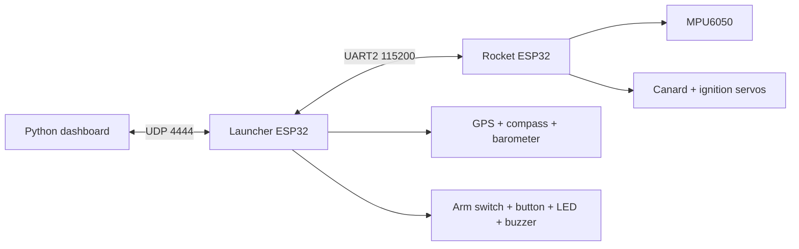
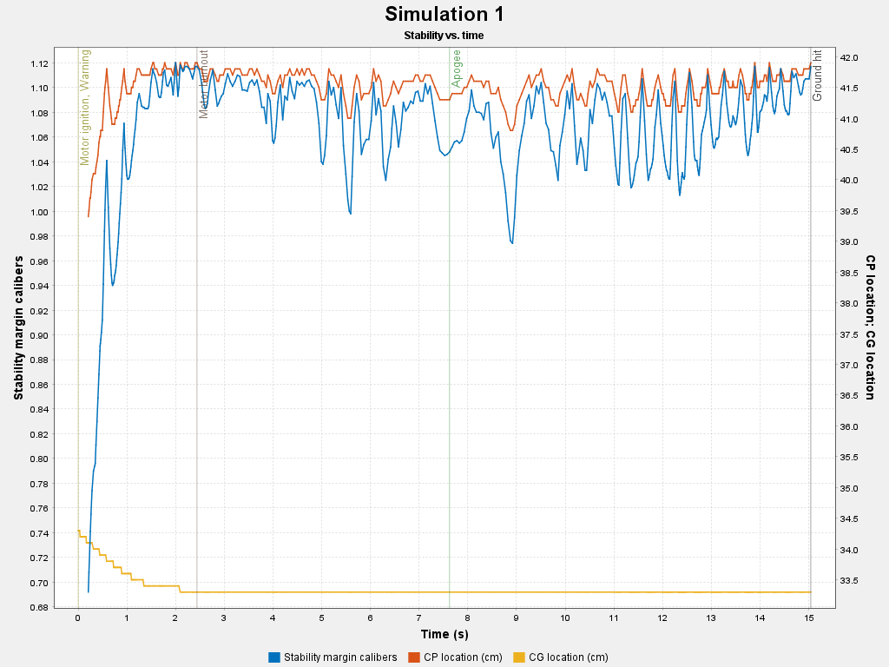

# Project 33: Low-Cost Folding-Fin Rocket Testbed

[](https://github.com/topherchris420/33/actions/workflows/ci.yml)
[](LICENSE)

**Vers3Dynamics | Applied Aerospace Research**

Project 33 is a low-cost aerospace engineering testbed for a folding-fin/canard rocket concept. It combines OpenRocket simulation, Fusion CAD, ESP32 firmware, an instrumented launcher, and a Python telemetry dashboard so design choices can be reviewed against code, tests, and captured bench evidence.

Current status: **bench-validation prototype**. The repository documents simulation, CAD, firmware, dashboard tooling, and safety gates; it does not claim flight-test results.

[Live project page](https://topherchris420.github.io/33/) | [Project Status](docs/PROJECT_STATUS.md) | [Paper Alignment](docs/PAPER_ALIGNMENT.md) | [Architecture](docs/ARCHITECTURE.md) | [Protocol](docs/PROTOCOL.md) | [Wiring](docs/WIRING.md) | [Bench Sessions](docs/BENCH_SESSIONS.md) | [Roadmap](docs/ROADMAP.md) | [Safety](docs/SAFETY.md) | [BOM](docs/BOM.md)


## Current Status

| Area | Status | Review evidence |
|------|--------|-----------------|
| Simulation | OpenRocket model and exported visuals are committed | `Simulation/`, [CAD notes](docs/CAD_ASSEMBLIES.md) |
| CAD | Fusion 360 archives are committed; annotated render exports are pending | `CAD Files/`, [CAD notes](docs/CAD_ASSEMBLIES.md) |
| Firmware | Rocket and launcher PlatformIO projects build in CI | [CI workflow](.github/workflows/ci.yml), [Testing](docs/TESTING.md) |
| Dashboard | Telemetry UI writes per-session CSV, graph, summary, and PID comparison artifacts | `Firmware/dashboard.py`, [Bench sessions](docs/BENCH_SESSIONS.md) |
| Bench evidence | Template and capture workflow are ready; representative physical evidence is not yet committed | [Evidence template](docs/BENCH_EVIDENCE_TEMPLATE.md), [Project status](docs/PROJECT_STATUS.md) |
| Flight testing | Not claimed | [Safety boundary](docs/SAFETY.md) |

## What It Demonstrates

- Folding-fin / canard rocket concept modeled in OpenRocket and Fusion 360.
- ESP32 rocket flight computer for MPU6050 roll sensing and servo output.
- ESP32 launcher ground station with WiFi AP, UART relay, GPS, compass, barometer, arming controls, LED, buzzer, and launch interlock.
- Python dashboard for telemetry plots, PID tuning, calibration commands, a disabled-by-default launch command path, automatic per-session CSV logs, graph exports, summaries, and PID comparison reports.
- Reproducible tests that keep wiring docs synchronized with firmware constants.
- Safety gates that reject dashboard launch commands by default, require an intentional firmware opt-in plus launcher READY for remote launch, and reject rocket ignition unless the rocket is ARMED.
- Rocket-side RAM ring-buffer logging that can be dumped after RF/dashboard telemetry interruptions.

## System Architecture



The detailed architecture and state machines are documented in [docs/ARCHITECTURE.md](docs/ARCHITECTURE.md).

## Map

| Path | Purpose |
|------|---------|
| `Firmware/Rocket/` | PlatformIO project for the rocket flight computer |
| `Firmware/Launcher/` | PlatformIO project for the launcher ground station |
| `Firmware/dashboard.py` | Tkinter telemetry dashboard and ground-control UI |
| `Firmware/telemetry_log.py` | CSV logger used by the dashboard |
| `Firmware/Calibration & Test Code/` | Standalone bench sketches for IMU/I2C/servo validation |
| `CAD Files/` | Fusion 360 archives and the NACA fin generator script |
| `Simulation/` | OpenRocket model and exported simulation visuals |
| `docs/` | Status, wiring, protocol, architecture, bench-session, CAD, PID, safety, BOM, and testing docs |
| `tests/`, `Firmware/tests/` | Python regression checks |

## Build and Verify

Install Python test dependencies:

```bash
python -m pip install -r Firmware/requirements-test.txt
```

Run repository checks:

```bash
python tools/generate_protocol.py --check
python -m pytest tests Firmware/tests -q
```

### Firmware

```bash
pio run -d Firmware/Rocket
pio run -d Firmware/Launcher
```

Upload examples:

```bash
pio run -d Firmware/Rocket -t upload
pio run -d Firmware/Launcher -t upload
```

### Dashboard

```bash
python -m pip install -r Firmware/requirements.txt
python Firmware/dashboard.py
```

When the dashboard starts, it creates a session folder in `Firmware/TestSessions/` containing `telemetry.csv`, `graph.png`, `pid-comparison.md`, and `session-summary.md`. That folder is ignored by git so raw bench runs do not pollute commits.

### Fusion 360 CAD Script

Install the Project 33 NACA fin script into Fusion's API Scripts folder:

```bash
python tools/install_fusion_script.py
```

Then open Fusion 360 and run `Project33NacaFin` from **Utilities -> Scripts and Add-Ins**.

GitHub Actions runs the Python checks and both PlatformIO builds on push and pull request.

## Evidence Standard




Professional claims in this repository should point to reproducible evidence: committed source, generated protocol artifacts, CI output, bench-session CSV files, graphs, photos, or explicit "not measured" notes. Dashboard sessions are created under `Firmware/TestSessions/`; use [docs/BENCH_EVIDENCE_TEMPLATE.md](docs/BENCH_EVIDENCE_TEMPLATE.md) before promoting a local run into shareable evidence.

The next grading-quality evidence to add is selected inert bench-test output from `Firmware/TestSessions/`, plus Fusion render exports/photos listed in [docs/CAD_ASSEMBLIES.md](docs/CAD_ASSEMBLIES.md).

## Cost Target

The prototype BOM is intentionally built around COTS hobby electronics and FDM-printed structure. The planning BOM estimates a prototype subtotal of about $81 before shipping and spares. See [docs/BOM.md](docs/BOM.md).

## Safety Boundary

This repository is for inert bench validation, simulation, and supervised educational testing. Do not treat the dashboard launch button, launcher firmware, or rocket firmware as authorization for live propulsion work. See [docs/SAFETY.md](docs/SAFETY.md) for safety gates and the inert demonstration checklist.

## Known Limitations and Next Steps

- No flight-test data is committed yet.
- No representative physical bench-session package is committed yet.
- Stabilization is currently roll-axis focused.
- Gyro integration can drift without additional filtering or reference correction.
- UDP is simple and useful for bench work, but it does not guarantee delivery.
- Real aerodynamic servo authority still needs physical validation.

See [docs/PROJECT_STATUS.md](docs/PROJECT_STATUS.md) and [docs/ROADMAP.md](docs/ROADMAP.md) for the current readiness matrix and next validation gates.
