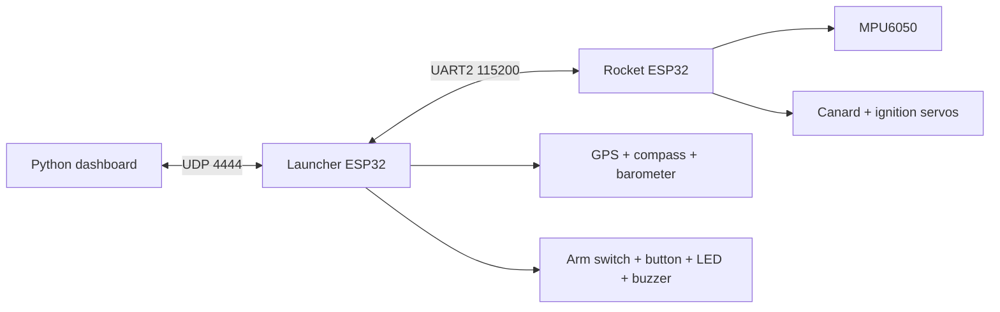

# Project 33: Low-Cost Folding-Fin Rocket System

**Vers3Dynamics | Applied Aerospace Research**

Project 33 is a college aerospace prototype showing that useful aerospace engineering practice - simulation, CAD, embedded control, telemetry, safety gates, and evidence capture - can be done with low-cost desktop tools instead of a billion-dollar lab.

[Live project page](https://topherchris420.github.io/33/) | [Architecture](docs/ARCHITECTURE.md) | [Wiring](docs/WIRING.md) | [Testing](docs/TESTING.md) | [Safety](docs/SAFETY.md) | [BOM](docs/BOM.md)


## What It Demonstrates

- Folding-fin / canard rocket concept modeled in OpenRocket and Fusion 360.
- ESP32 rocket flight computer for MPU6050 roll sensing and servo output.
- ESP32 launcher ground station with WiFi AP, UART relay, GPS, compass, barometer, arming controls, LED, buzzer, and launch interlock.
- Python dashboard for telemetry plots, PID tuning, calibration commands, launch commands, graph export, and automatic CSV logs.
- Reproducible tests that keep wiring docs synchronized with firmware constants.
- Safety gates that reject dashboard launch commands unless the launcher is already READY and reject rocket ignition unless the rocket is ARMED.

## System Architecture



The detailed architecture and state machines are documented in [docs/ARCHITECTURE.md](docs/ARCHITECTURE.md).

## Repository Map

| Path | Purpose |
|------|---------|
| `Firmware/Rocket/` | PlatformIO project for the rocket flight computer |
| `Firmware/Launcher/` | PlatformIO project for the launcher ground station |
| `Firmware/dashboard.py` | Tkinter telemetry dashboard and ground-control UI |
| `Firmware/telemetry_log.py` | CSV logger used by the dashboard |
| `Firmware/Calibration & Test Code/` | Standalone bench sketches for IMU/I2C/servo validation |
| `CAD Files/` | Fusion 360 archives and the NACA fin generator script |
| `Simulation/` | OpenRocket model and exported simulation visuals |
| `docs/` | Wiring, protocol, architecture, safety, BOM, and testing docs |
| `tests/`, `Firmware/tests/` | Python regression checks |

## Build and Run

### Firmware

```bash
pio run -d Firmware/Rocket
pio run -d Firmware/Launcher
```

Upload examples:

```bash
pio run -d Firmware/Rocket -t upload
pio run -d Firmware/Launcher -t upload
```

### Dashboard

```bash
python -m pip install -r Firmware/requirements.txt
python Firmware/dashboard.py
```

When the dashboard starts, it creates a CSV log in `Firmware/TelemetryLogs/`. That folder is ignored by git so bench runs do not pollute commits.

### Tests

```bash
python -m pytest tests Firmware/tests -q
```

GitHub Actions runs the Python checks and both PlatformIO builds on push and pull request.

## Current Evidence


The repo currently includes simulation artifacts, CAD archives, firmware, dashboard code, and automated checks. The next grading-quality evidence to add is bench-test output: CSV telemetry logs, saved dashboard graphs, short videos/photos of servo response, and calibration notes.

## Cost Target

The prototype BOM is intentionally built around COTS hobby electronics and FDM-printed structure. The planning BOM estimates a prototype subtotal of about $81 before shipping and spares. See [docs/BOM.md](docs/BOM.md).

## Safety Boundary

This repository is for inert bench validation, simulation, and supervised educational testing. Do not treat the dashboard launch button or firmware as authorization for live propulsion work. See [docs/SAFETY.md](docs/SAFETY.md) for the safety gates and inert demonstration checklist.

## Known Limitations

- No flight-test data is committed yet.
- Stabilization is currently roll-axis focused.
- Gyro integration can drift without additional filtering or reference correction.
- UDP is simple and useful for bench work, but it does not guarantee delivery.
- Real aerodynamic servo authority still needs physical validation.

## Next Improvements

- Add bench CSV logs and saved graph exports after each test session.
- Add photos/renders for each CAD assembly and document dimensions/materials.
- Add a tuned control-data section comparing PID settings.
- Add onboard logging if RF telemetry loss becomes a test blocker.
- Convert repeated protocol constants into a generated or shared reference if the firmware grows.
