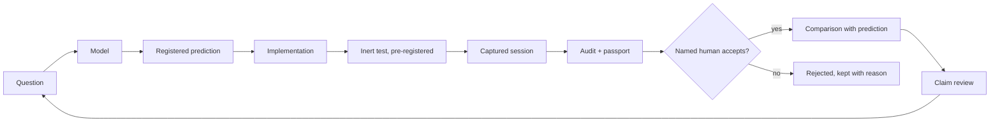
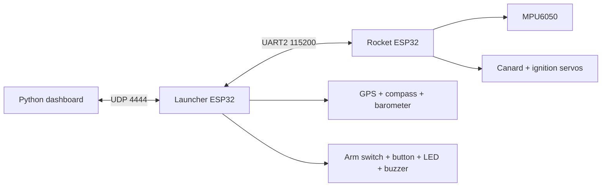
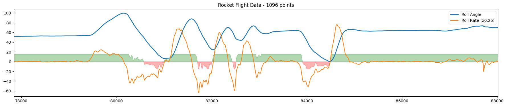

# Project 33

[](https://github.com/topherchris420/33/actions/workflows/ci.yml)
[](LICENSE)

**Vers3Dynamics | Applied Aerospace Research**

**A small, inexpensive folding-fin rocket testbed in which every engineering claim is tied to the exact artifacts that support it, the class of evidence those artifacts are, and the measurements still missing.**

The rocket is the specimen. The record of how engineering knowledge moves from assumption to model to implementation to measurement is the product.

## Current status

Project 33 is a **bench-validation prototype**. It has models, CAD, firmware that compiles, a telemetry dashboard, and automated checks. **No physical measurement has been accepted into the evidence record.** Nothing here is flight-tested or flight-ready, and live propulsion is outside the repository's validation boundary.

<!-- evidence:counts -->
**Record state:** 8 claims · 3 contradicted · 4 unresolved · 1 supported within stated limits · 0 accepted physical measurements · 17 open discrepancies of 24 · 5 of 5 predictions not measured.
<!-- /evidence:counts -->

Unresolved is a valid engineering state. Several research claims are currently contradicted by their own models, and saying so is the point.

## Evidence Observatory

The [Evidence Observatory](docs/EVIDENCE_OBSERVATORY.md) (`evidence/`, Python standard library only, fully offline) is the centre of the project. For every claim it answers:

- **What is claimed?** A passport per claim: question, current statement, status, assumptions, limitations.
- **What stands behind it, and what kind of evidence is that?** Exact files with SHA-256 digests, each classed on an evidence ladder: specification, implementation, test procedure, synthetic, analytical, simulated, software verified, bench observed, bench measured.
- **Does it meet its requirements?** Machine-checkable requirements are evaluated from committed values and labeled with the evidence class they came from: *SATISFIED (analytical)* is not *SATISFIED (bench measured)*.
- **What disagrees?** A [discrepancy register](docs/DISCREPANCIES.md) of recorded mismatches between models, requirements, documentation, firmware, CAD, and the BOM.
- **What is still unknown?** Predictions frozen before measurement, shown as **NOT MEASURED**, never zero.
- **What changed, and which reviews are no longer sufficient?** Dependency tracking marks a claim's review stale when any file it rests on changes, without declaring the claim false.

Support is derived, never authored: a model cannot become a measurement, synthetic data cannot be relabeled as physical, and no claim can be promoted past a validation gate without a human-accepted inert measurement. The tooling refuses to build a report from a record that tries.

## The engineering loop


```mermaid
flowchart LR
    Q[Question] --> M[Model] --> P[Registered prediction] --> I[Implementation]
    I --> T[Inert test, pre-registered] --> E[Captured session] --> A[Audit + passport]
    A --> H{Named human accepts?} -->|yes| C[Comparison with prediction] --> R[Claim review] --> Q
    H -->|no| X[Rejected, kept with reason]
```

Software may propose an inert experiment and check it against machine-readable rules. A human decides whether to perform it. Only the resulting measurement, accepted by a named reviewer, enters the record. Confidence is not authority.

## System components

| Component | What it is | Evidence it carries today |
|---|---|---|
| OpenRocket model + static-margin scripts | `Simulation/` | Analytical; two formulations disagree (D-006) |
| Mechanism, spring, mass, structural models | `mechanism/`, `materials/`, `structures/` | Analytical/simulated; reproduced in CI |
| Fusion 360 archives + CAD generators | `CAD Files/` | Implementation; NACA generator software-tested |
| Rocket flight computer (ESP32) | `Firmware/Rocket/` | Compiles in CI; no bench capture |
| Launcher ground station (ESP32) | `Firmware/Launcher/` | Compiles in CI; interlocks source-checked, not bench-verified |
| Telemetry dashboard | `Firmware/dashboard.py` | Writes raw sessions with metadata, command log, and quality counters |
| Evidence Observatory | `evidence/` | Portable review packets, session passports, record checks |


```mermaid
flowchart LR
    Dashboard[Python dashboard] <-->|UDP 4444| Launcher[Launcher ESP32]
    Launcher <-->|UART2 115200| Rocket[Rocket ESP32]
    Rocket --> IMU[MPU6050]
    Rocket --> Servos[Canard + ignition servos]
    Launcher --> Sensors[GPS + compass + barometer]
    Launcher --> Interlocks[Arm switch + button + LED + buzzer]
```

Details: [Architecture](docs/ARCHITECTURE.md) · [Protocol](docs/PROTOCOL.md) · [Wiring](docs/WIRING.md).

## Claim status

<!-- evidence:claims-table -->
**Record state:** 8 claims · 3 contradicted · 4 unresolved · 1 supported within stated limits · 0 accepted physical measurements · 17 open discrepancies of 24 · 5 of 5 predictions not measured.

| Claim | Subject | Status | Strongest accepted evidence | Failing or disputed requirements | Open discrepancies |
|---|---|---|---|---|---|
| [C1](docs/claims/C1.md) | Folding-fin mechanism model | **CONTRADICTED** | MODEL ONLY | R-C1-CLOSURE NOT SATISFIED | D-002, D-004, D-005 |
| [C2](docs/claims/C2.md) | Deployment timing | **UNRESOLVED** | IMPLEMENTATION ONLY | none failing | D-017, D-018, D-024 |
| [C3](docs/claims/C3.md) | CAD generator software | **SUPPORTED WITHIN STATED LIMITS** | IMPLEMENTATION ONLY | none failing | none |
| [C4](docs/claims/C4.md) | Material mass accounting | **UNRESOLVED** | MODEL ONLY | none failing | D-010, D-022 |
| [C5](docs/claims/C5.md) | Static-stability model | **UNRESOLVED** | MODEL ONLY | R-C5-WINDOW MODELS DISAGREE | D-006, D-007, D-008, D-009, D-023 |
| [C6](docs/claims/C6.md) | Spring margin consistency | **CONTRADICTED** | MODEL ONLY | R-C6-MARGIN NOT SATISFIED | D-009, D-010, D-011 |
| [C7](docs/claims/C7.md) | Deployment reliability evidence | **UNRESOLVED** | MODEL ONLY | none failing | D-010, D-013 |
| [C8](docs/claims/C8.md) | Structural claim boundaries | **CONTRADICTED** | MODEL ONLY | R-C8-MODULUS NOT SATISFIED | D-009, D-010, D-015 |
<!-- /evidence:claims-table -->

Each claim links to a generated passport. The full requirement matrix and prediction ledger are in [Traceability](docs/TRACEABILITY.md).

## What has actually been demonstrated

Only software-level facts, each with a named scope:

- **Firmware builds:** both PlatformIO projects compile in CI. Compiling is not hardware behavior.
- **Software tests:** the Python suite passes in CI; CI review packets attach the JUnit run record.
- **Model reproduction:** every committed model output regenerates from source and matches by value (`python -m evidence reproduce`).
- **Record consistency:** requirements, predictions, reviews, archive digests, and generated documents agree (`python -m evidence check`).
- **Interlocks are implemented in source:** every gate in the registry is pinned to exact source lines by tests ([Safety](docs/SAFETY.md)).

## What has not been measured

Everything physical. Timing jitter, spring rate, part masses, dry CG, servo authority, gyro drift, current draw, interlock behavior on hardware, mechanism deployment, and stiffness are all **NOT MEASURED**. Inert experiments are drafted as pre-registrations awaiting adoption by a human (P-001 timing, P-002 spring rate, P-003 drift).

## Reproduce the review

Python 3.11+, no packages, no network, no hardware:

```bash
python -m evidence status                          # claim table, requirement results, scopes
python -m evidence check                           # strict: drift, stale reviews, stale generated docs
python -m evidence build --output build/review     # portable packet: open build/review/index.html
python -m evidence verify build/review             # integrity only; not scientific validity
python -m evidence query                           # grounded evidence questions
python -m evidence impact mechanism/spring_sizing.py   # what a change would affect
```

With the model dependencies installed (`pip install -r requirements-evidence.txt`), `python -m evidence reproduce` regenerates every model output in a temporary directory and compares values. `make review-full` builds a packet with the test and reproduction run records attached.

## Validation roadmap

The project moves only through explicit gates: **analytical model → software reproduction → synthetic test → inert bench setup → inert physical measurement → repeated measurement → independent review.** Gates from inert bench setup onward need a human-registered pre-registration or a human-accepted measurement. No AI model, CI run, or repository setting can move a claim across them. Next steps are in the [Roadmap](docs/ROADMAP.md); the readiness matrix is in [Project Status](docs/PROJECT_STATUS.md).

## Safety boundary

This repository is for inert bench validation, simulation, and engineering review. Dashboard launch is rejected by default in firmware; the physical arming switch, readiness handshake, heartbeat timeout, and rocket-side arming state all stay in force, and refusals are logged. Automated tools, including AI assistants, may interpret the record; they may not create measurements, accept sessions, or touch any safety gate. See [Safety](docs/SAFETY.md). Field testing is a separate, safety-reviewed process outside this repository.

## Repository map

| Path | Purpose |
|------|---------|
| `evidence/` | Evidence Observatory: claim catalog, requirements, predictions, measurements, discrepancies, sessions, pre-registrations, reviews, failure archive, reviewer code |
| `docs/claims/` | Generated claim passports |
| `docs/TRACEABILITY.md`, `docs/DISCREPANCIES.md` | Generated requirement matrix, prediction ledger, discrepancy register, failure archive |
| `docs/EVIDENCE/` | Committed model outputs (JSON/CSV) and rendered plots |
| `mechanism/`, `materials/`, `structures/`, `Simulation/` | Analytical and simulation models |
| `CAD Files/` | Fusion 360 archives, NACA fin generator, Fusion scripts |
| `Firmware/Rocket/`, `Firmware/Launcher/` | PlatformIO firmware |
| `Firmware/dashboard.py` | Tkinter telemetry dashboard (raw session capture) |
| `protocol/` | Canonical protocol definition; generates the firmware header and [Protocol](docs/PROTOCOL.md) |
| `tools/` | Protocol generator, documentation link checker, review figures, Fusion script installer |
| `tests/`, `Firmware/tests/` | Regression and adversarial tests |

## Build and run

```bash
python -m pip install -r Firmware/requirements-test.txt
python tools/generate_protocol.py --check
python -m pytest tests Firmware/tests -q
```

Firmware (create the local WiFi header first; it is git-ignored):

```bash
cp Firmware/Launcher/src/wifi_config.h.example Firmware/Launcher/src/wifi_config.h
pio run -d Firmware/Rocket
pio run -d Firmware/Launcher
```

Dashboard: `python -m pip install -r Firmware/requirements.txt`, then `python Firmware/dashboard.py`. Each run writes a raw session folder under `Firmware/TestSessions/` (git-ignored); see [Bench Sessions](docs/BENCH_SESSIONS.md) for turning a run into reviewable evidence.

Fusion 360 script: `python tools/install_fusion_script.py`, then run `Project33NacaFin` from **Utilities -> Scripts and Add-Ins**.

## Cost

<!-- evidence:cost -->
Estimated prototype subtotal: **$81** from 10 BOM lines (10 estimates, 0 purchased prices recorded, source dates not recorded, shipping and spares excluded). An estimate is not a purchase record; see [BOM](docs/BOM.md) and D-021.
<!-- /evidence:cost -->



*OpenRocket export; the model revision that produced it is not recorded (D-023).*

[Live project page](https://topherchris420.github.io/33/) · [Project Status](docs/PROJECT_STATUS.md) · [Paper Alignment](docs/PAPER_ALIGNMENT.md) · [Roadmap](docs/ROADMAP.md) · [Safety](docs/SAFETY.md) · [Testing](docs/TESTING.md) · [BOM](docs/BOM.md)
