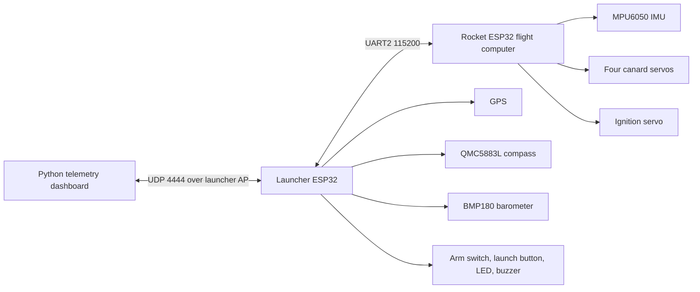
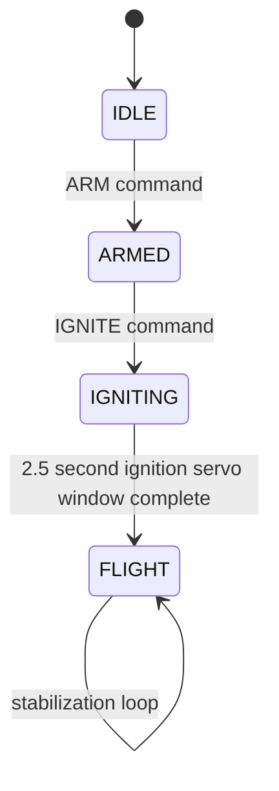

# Architecture

Project 33 is split into four subsystems: the airframe/CAD package, the rocket flight computer, the launcher ground station, and the Python dashboard.

## Responsibilities

| Subsystem | Responsibility | Main files |
|-----------|----------------|------------|
| Rocket flight computer | IMU roll integration, PID output, canard servo control, rocket-side arming and ignition acknowledgement | `Firmware/Rocket/src/main.cpp` |
| Launcher ground station | WiFi AP, dashboard UDP link, UART relay to rocket, GPS/barometer/compass telemetry, physical launch interlock | `Firmware/Launcher/src/main.cpp` |
| Dashboard | Live plot, PID tuning commands, launch/calibration commands, automatic CSV logging | `Firmware/dashboard.py`, `Firmware/telemetry_log.py` |
| Simulation/CAD | OpenRocket stability model, CAD packages, airfoil generation script | `Simulation/`, `CAD Files/` |

## Launcher State Machine

Safety behavior:

- UDP `launch` is accepted only in `READY`.
- The arming switch must stay active after leaving `SAFE`.
- Launcher aborts on rocket heartbeat timeout.
- Abort reasons are relayed to the dashboard as raw log rows.

## Rocket State Machine

Safety behavior:

- Rocket-side `IGNITE` is ignored unless the rocket is already `ARMED`.
- Canards remain centered until `FLIGHT`.
- Gyro calibration runs when entering `ARMED` and on explicit `CALIBRATE`.

## Protocol Reference

The canonical wiring and message reference lives in [WIRING.md](WIRING.md). Automated tests compare that document against the firmware constants that are easy to drift during iteration.
