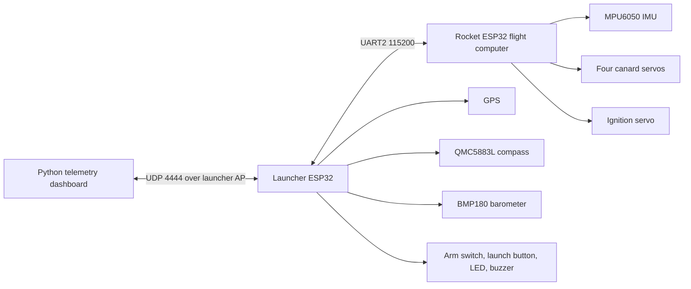
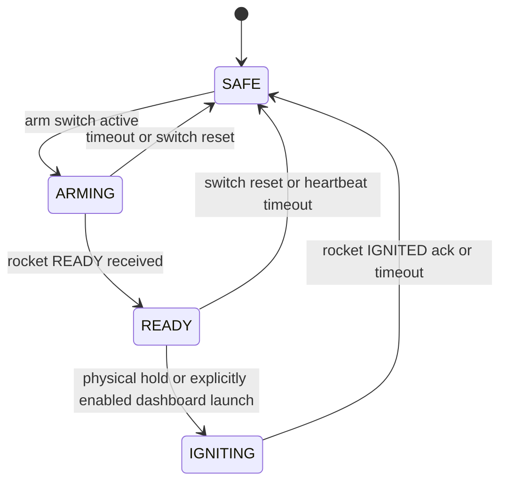
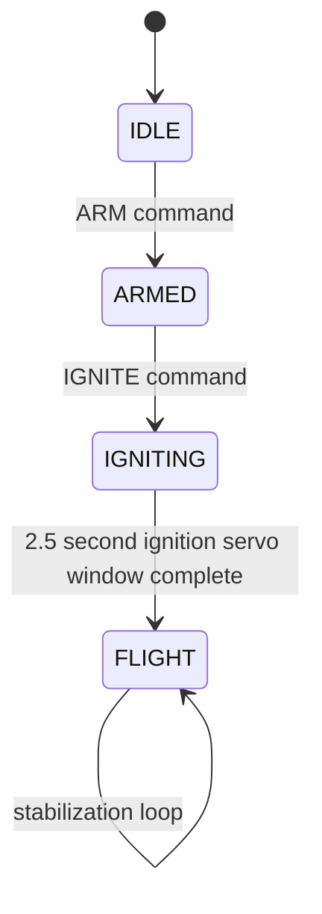

# Architecture

Project 33 is split into four subsystems: the airframe/CAD package, the rocket flight computer, the launcher ground station, and the Python dashboard.

## Responsibilities

| Subsystem | Responsibility | Main files |
|-----------|----------------|------------|
| Rocket flight computer | IMU roll integration, PID output, canard servo control, rocket-side arming, ignition acknowledgement, RAM ring-buffer log dump | `Firmware/Rocket/src/main.cpp` |
| Launcher ground station | WiFi AP, dashboard UDP link, UART relay to rocket, GPS/barometer/compass telemetry, physical launch interlock | `Firmware/Launcher/src/main.cpp` |
| Dashboard | Live plot, PID tuning commands, launch/calibration commands, automatic CSV logging, graph export, PID comparison, onboard log dump request | `Firmware/dashboard.py`, `Firmware/telemetry_log.py`, `Firmware/analyze_pid.py`, `Firmware/session_artifacts.py` |
| Protocol reference | Generates firmware protocol constants and Markdown docs from one JSON source | `protocol/project33_protocol.json`, `tools/generate_protocol.py` |
| Simulation/CAD | OpenRocket stability model, CAD packages, airfoil generation script, CAD render/material notes | `Simulation/`, `CAD Files/`, `docs/CAD_ASSEMBLIES.md` |

## Launcher State Machine

Safety behavior:

- UDP `launch` is rejected by default. If `ENABLE_DASHBOARD_LAUNCH` is intentionally set true for an inert test, it is still accepted only in `READY`.
- The arming switch must stay active after leaving `SAFE`.
- Launcher aborts on rocket heartbeat timeout.
- Abort reasons are relayed to the dashboard as raw log rows.
- UDP `dumplog` is forwarded to the rocket as `DUMPLOG` for onboard log recovery.

## Rocket State Machine

Safety behavior:

- Rocket-side `IGNITE` is ignored unless the rocket is already `ARMED`.
- Canards remain centered until `FLIGHT`.
- Gyro calibration runs when entering `ARMED` and on explicit `CALIBRATE`.
- Rocket telemetry samples are copied into a 240-sample RAM ring buffer that can be dumped after telemetry loss.

## Bench Evidence Flow

The dashboard owns per-session evidence capture. Each run creates a local session folder containing raw CSV telemetry, an exported graph, a PID comparison report, and a summary. If live telemetry drops, the dashboard can request the rocket RAM ring buffer with `dumplog`; the launcher forwards the request as `DUMPLOG` and relays `LOG` rows back to the dashboard.

## Protocol Reference

The canonical wiring reference lives in [WIRING.md](WIRING.md). Message constants live in `protocol/project33_protocol.json` and generate both [PROTOCOL.md](PROTOCOL.md) and `Firmware/shared/Project33Protocol.h`.
