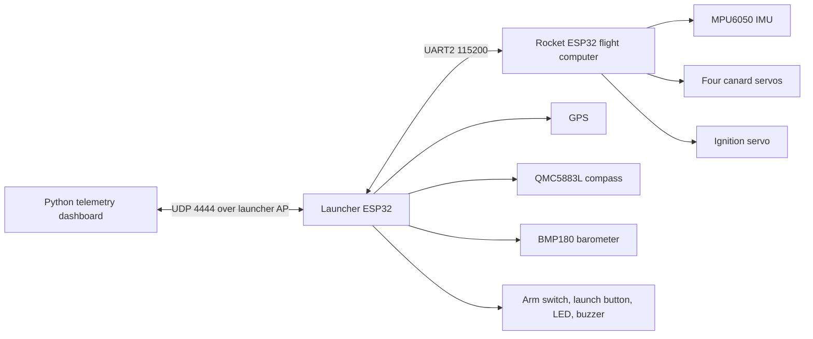
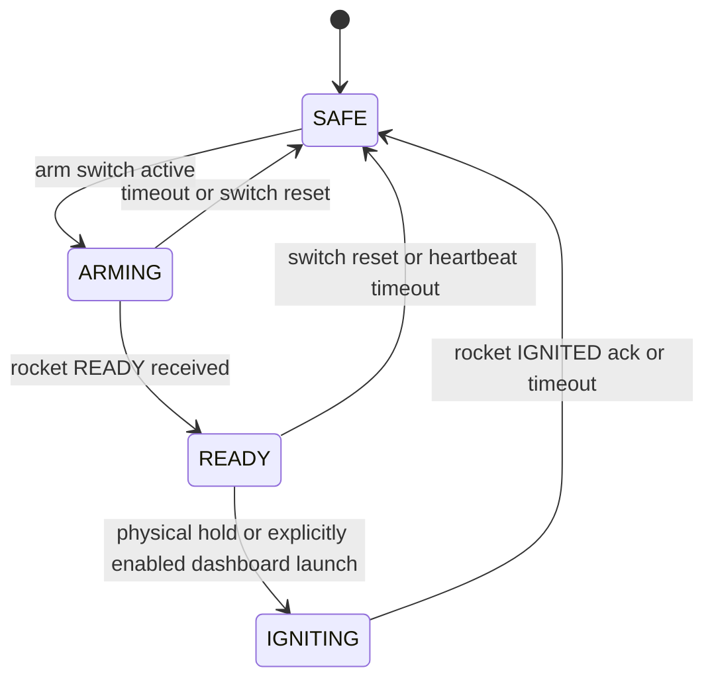
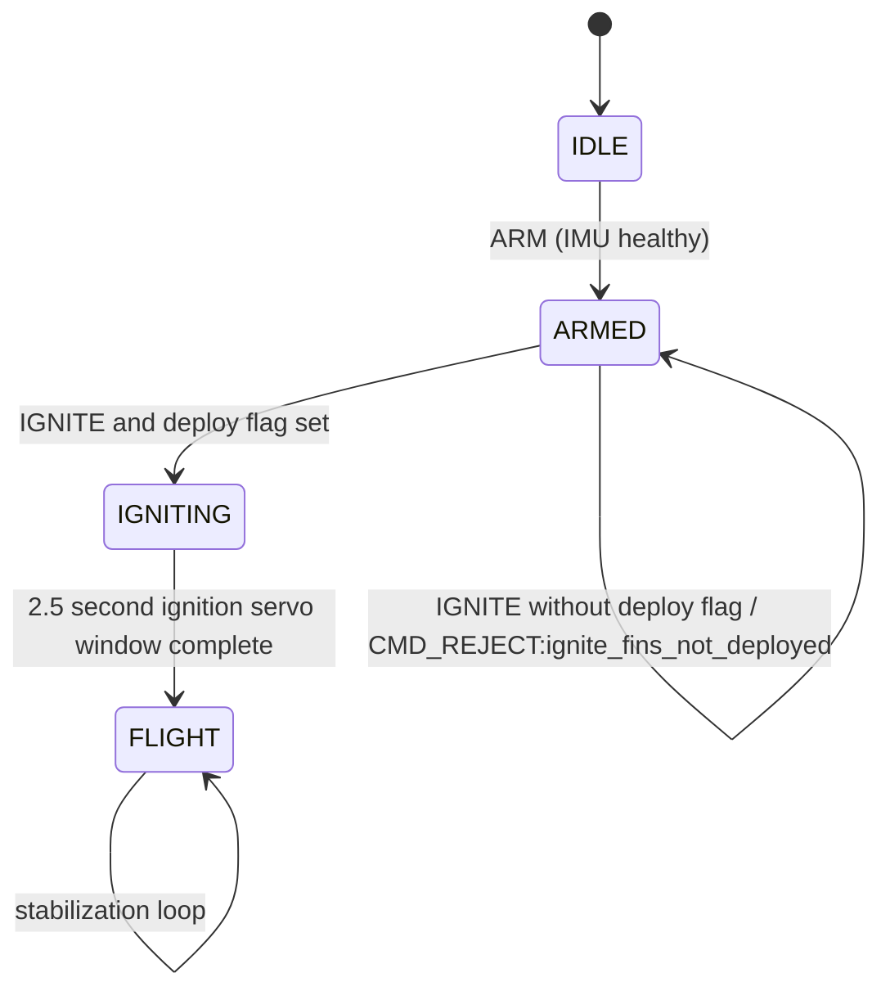
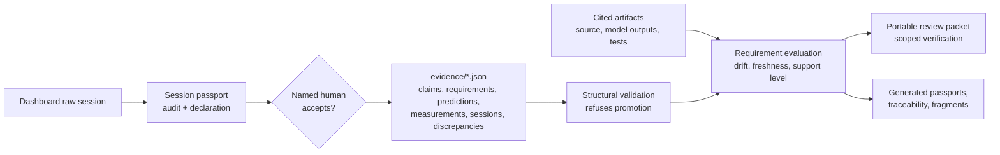

# Architecture

Project 33 is split into four subsystems: the airframe/CAD package, the rocket flight computer, the launcher ground station, and the Python dashboard.

```mermaid
flowchart LR
    Dashboard[Python telemetry dashboard] <-->|UDP 4444 over launcher AP| Launcher[Launcher ESP32]
    Launcher <-->|UART2 115200| Rocket[Rocket ESP32 flight computer]
    Rocket --> MPU[MPU6050 IMU]
    Rocket --> Canards[Four canard servos]
    Rocket --> Ignition[Ignition servo]
    Launcher --> GPS[GPS]
    Launcher --> Compass[QMC5883L compass]
    Launcher --> Barometer[BMP180 barometer]
    Launcher --> Interlocks[Arm switch, launch button, LED, buzzer]
```

## Responsibilities

| Subsystem | Responsibility | Main files |
|-----------|----------------|------------|
| Rocket flight computer | IMU roll integration, PID output, canard servo control, rocket-side arming, ignition acknowledgement, RAM ring-buffer log dump | `Firmware/Rocket/src/main.cpp` |
| Launcher ground station | WiFi AP, dashboard UDP link, UART relay to rocket, GPS/barometer/compass telemetry, physical launch interlock | `Firmware/Launcher/src/main.cpp` |
| Dashboard | Live plot, PID tuning commands, launch/calibration commands, automatic CSV logging, graph export, PID comparison, onboard log dump request | `Firmware/dashboard.py`, `Firmware/telemetry_log.py`, `Firmware/analyze_pid.py`, `Firmware/session_artifacts.py` |
| Protocol reference | Generates firmware protocol constants and Markdown docs from one JSON source | `protocol/project33_protocol.json`, `tools/generate_protocol.py` |
| Simulation/CAD | OpenRocket stability model, CAD packages, airfoil generation script, CAD render/material notes | `Simulation/`, `CAD Files/`, `docs/CAD_ASSEMBLIES.md` |

## Launcher State Machine

```mermaid
stateDiagram-v2
    [*] --> SAFE
    SAFE --> ARMING: arm switch active
    ARMING --> READY: rocket READY received
    ARMING --> SAFE: timeout or switch reset
    READY --> IGNITING: physical hold or explicitly enabled dashboard launch
    READY --> SAFE: switch reset or heartbeat timeout
    IGNITING --> SAFE: rocket IGNITED ack or timeout
```

Safety behavior:

- UDP `launch` is rejected by default. If `ENABLE_DASHBOARD_LAUNCH` is intentionally set true for an inert test, it is still accepted only in `READY`.
- The arming switch must stay active after leaving `SAFE`.
- Launcher aborts on rocket heartbeat timeout.
- Abort reasons are relayed to the dashboard as raw log rows.
- UDP `dumplog` is forwarded to the rocket as `DUMPLOG` for onboard log recovery.

## Rocket State Machine

```mermaid
stateDiagram-v2
    [*] --> IDLE
    IDLE --> ARMED: ARM (IMU healthy)
    ARMED --> IGNITING: IGNITE and deploy flag set
    ARMED --> ARMED: IGNITE without deploy flag / CMD_REJECT:ignite_fins_not_deployed
    IGNITING --> FLIGHT: 2.5 second ignition servo window complete
    FLIGHT --> FLIGHT: stabilization loop
```

Safety behavior:

- `ARM` is accepted only in `IDLE` with a healthy MPU6050; otherwise the rocket replies `CMD_REJECT:arm_not_idle` or `CMD_REJECT:sensor_unavailable`.
- `IGNITE` is accepted only in `ARMED` with a healthy MPU6050 **and** the deploy flag set; otherwise the rocket replies `CMD_REJECT:ignite_not_armed`, `CMD_REJECT:sensor_unavailable`, or `CMD_REJECT:ignite_fins_not_deployed`. The launcher forwards every `CMD_REJECT:` line to the dashboard CSV.
- The deploy flag is set only by the hardware-timer callback, which is armed by a >15 g x-axis reading while not `IDLE`. Under the nominal sequence (IGNITE before boost) the rocket therefore refuses IGNITE and the launcher aborts with "No IGNITED ACK received". This ordering is an open design question (D-017); on the bench it acts as an extra interlock and must not be removed without a safety review.
- `FLIGHT` means "ignition actuation commanded"; it is not confirmation of ignition.
- Canards remain centered until `FLIGHT`. Gyro calibration runs on entering `ARMED` and on explicit `CALIBRATE` (not acknowledged).
- Telemetry samples go into a 240-sample RAM ring buffer that `DUMPLOG` returns as `LOG_START,<count>`, `LOG,...` rows, and `LOG_END`.

## Bench Evidence Flow

The dashboard owns per-session evidence capture. Each run creates a local session folder containing raw CSV telemetry, an exported graph, a PID comparison report, and a summary. If live telemetry drops, the dashboard can request the rocket RAM ring buffer with `dumplog`; the launcher forwards the request as `DUMPLOG` and relays `LOG` rows back to the dashboard.

## Evidence Architecture

```mermaid
flowchart LR
    Records[evidence/*.json<br>claims, requirements, predictions,<br>measurements, sessions, discrepancies] --> Validate[Structural validation<br>refuses promotion]
    Artifacts[Cited artifacts<br>source, model outputs, tests] --> Evaluate
    Validate --> Evaluate[Requirement evaluation<br>drift, freshness, support level]
    Evaluate --> Packet[Portable review packet<br>scoped verification]
    Evaluate --> Docs[Generated passports,<br>traceability, fragments]
    Session[Dashboard raw session] --> Passport[Session passport<br>audit + declaration] --> Human{Named human<br>accepts?} --> Records
```

The [Evidence Observatory](EVIDENCE_OBSERVATORY.md) is a separate standard-library package with no network or command-transport dependency. It reads committed files or completed captures and writes review packets; it never talks to firmware. A successful check cannot change an evidence class, accept a session, or approve hardware readiness.

## Clock Domains

Live `T` packets are stamped with the launcher's `millis()` when it relays a rocket `DATA` line; `DATA` carries no rocket timestamp. Recovered `LOG` rows carry the rocket's `millis()` at sample time. The two clocks are never mixed in timing statistics (D-018).

## Protocol Reference

The canonical wiring reference lives in [WIRING.md](WIRING.md). Message constants live in `protocol/project33_protocol.json` and generate both [PROTOCOL.md](PROTOCOL.md) and `Firmware/shared/Project33Protocol.h`.
