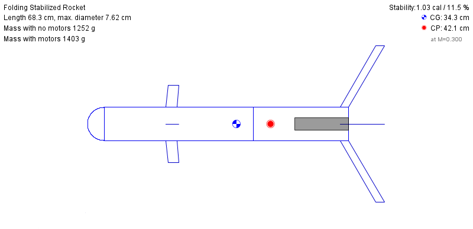

# CAD Assemblies, Renders, Dimensions, and Materials

The authoritative CAD source files are the Fusion 360 archives in `CAD Files/`. The repo also includes OpenRocket render exports for the rocket configuration in `Simulation/`.

## Render Coverage

| Assembly | CAD Source | Current Visual Evidence | Render Export Target |
|----------|------------|-------------------------|----------------------|
| Folding rocket | `CAD Files/Folding Rocket.f3z` | `Simulation/OpenRocket_3D_View.png`, `Simulation/Side_View.png` | Add Fusion render of full folded/deployed assembly |
| Launcher platform | `CAD Files/Launcher Platform.f3z` | CAD archive metadata confirms platform components | Add top/isometric Fusion render of switch, ESP32, and platform layout |
| Rocket nozzle | `CAD Files/Rocket Nozzle.f3z` | CAD archive metadata confirms nozzle body files | Add sectioned Fusion render with throat/exit dimensions |

## Assembly Metadata Extracted From Fusion Archives

### Folding Rocket

Archive: `CAD Files/Folding Rocket.f3z`

Fusion metadata names these referenced components:

- `Folding Rocket REDO -_-`
- `MPU6050 v2`
- `mg996R_v2`
- `SG90 - Micro Servo 9g - Tower Pro.1`
- `SG90 - Micro Servo 9g - Tower Pro.2`
- `Servo Horns`
- `XL601 Power Switch v4`

Known dimensions from repository artifacts:

| Dimension | Value | Source |
|-----------|-------|--------|
| NACA fin chord | 60 mm | `CAD Files/naca_fin_generator.py` |
| Airfoil family | NACA 0012 | `CAD Files/naca_fin_generator.py` |
| Servo center range | 80-115 degrees by axis | `docs/WIRING.md` |
| Control deflection limit | +/-12 degrees | `Firmware/Rocket/src/main.cpp` |

Material plan:

| Part | Prototype Material | Notes |
|------|--------------------|-------|
| Airframe and folding-fin structure | PLA+ or PETG for inert bench prototype | Use PETG/nylon/composite only after fit and heat checks |
| Servo horns/linkages | Stock servo horn plastic for bench tests | Replace with stronger linkage if load testing shows flex |
| Electronics mounts | FDM printed PLA+/PETG | Keep sensor mount rigid relative to rocket axis |

### Launcher Platform

Archive: `CAD Files/Launcher Platform.f3z`

Fusion metadata names these referenced components:

- `ESP32 WROOM WIth Socket Headers`
- `Microswitch_P-B1729`
- `Stinger knockoff lol`
- `Tactal Switch -THru (6mmx 6mmx5mm)-Red`
- `XL601 Power Switch v4`

Known dimensions from repository artifacts:

| Dimension | Value | Source |
|-----------|-------|--------|
| Tactile switch package | 6 mm x 6 mm x 5 mm | Fusion component name |
| ESP32 board family | ESP32 WROOM with socket headers | Fusion component name |
| Launcher control pins | GPIO 5, 18, 23, 2, 19 | `docs/WIRING.md` |

Material plan:

| Part | Prototype Material | Notes |
|------|--------------------|-------|
| Platform body | PLA+ or PETG | PETG preferred if left in a warm environment |
| Switch mounts | PLA+/PETG | Add strain relief for repeated switch/button operation |
| Fasteners | M2/M3 machine screws or heat-set inserts | Use inserts if the platform will be assembled repeatedly |

### Rocket Nozzle

Archive: `CAD Files/Rocket Nozzle.f3z`

Fusion metadata names these referenced components:

- `Rocket Nozzle`
- `nozzle`

Material plan:

| Part | Prototype Material | Notes |
|------|--------------------|-------|
| Nozzle model | Inert display/fit-check print only | Do not use printed nozzle material for live propulsion without separate thermal/pressure validation |
| Sectioned render | Fusion export | Include throat, exit, and length dimensions before any physical test claim |

## Dimension Export Checklist

Before final submission, export a Fusion drawing or annotated render for each assembly showing:

- Overall length, width, and height
- Servo mount spacing
- Fin chord, span, thickness, hinge offset, and deployed angle
- Launcher switch/button spacing
- Nozzle throat diameter, exit diameter, convergence/divergence angles, and length
- Material choice and print settings used for each printed part
