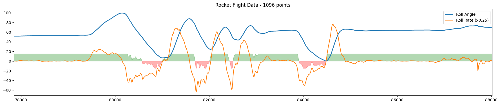

# Project 33: Low-Cost Folding-Fin Rocket System

**Vers3Dynamics | Applied Aerospace Research**

Project 33 is a college aerospace prototype showing how a folding-fin rocket system can be modeled, built, instrumented, and documented with low-cost desktop tools: ESP32 firmware, COTS sensors, FDM-printed parts, OpenRocket simulation, Fusion CAD, and a Python telemetry dashboard.

## What This Repository Contains

| Area | Contents |
|------|----------|
| CAD | Fusion 360 design archives, render coverage notes, and a NACA 4-digit airfoil generator |
| Simulation | OpenRocket model, side view, 3D view, and stability graph |
| Firmware | Rocket flight computer, launcher ground station, calibration sketches, shared protocol header |
| Dashboard | Ground-control UI with per-session CSV logs, graph export, onboard log dump, and PID comparison reports |
| Docs | Wiring, generated protocol, architecture, bench evidence, CAD, PID, safety, BOM, and testing docs |

## System Overview

The Python dashboard talks to the launcher over UDP. The launcher owns the WiFi access point, physical arming controls, GPS/barometer/compass telemetry, and the UART bridge to the rocket. The rocket owns IMU roll sensing, canard servo output, rocket-side arming/ignition state, and a RAM ring buffer for onboard log dumps.

See [Architecture](docs/ARCHITECTURE.md), [Protocol](docs/PROTOCOL.md), and [Wiring](docs/WIRING.md) for the full system map.

## Current Evidence

The repository currently includes simulation artifacts, CAD archives, firmware, dashboard code, generated protocol docs, and automated checks. Bench logs generated by the dashboard are stored locally in `Firmware/TestSessions/` with CSV, graph, summary, and PID comparison artifacts for each run.

## Project Documents

- [Architecture](docs/ARCHITECTURE.md)
- [Generated protocol reference](docs/PROTOCOL.md)
- [Wiring reference](docs/WIRING.md)
- [Bench session evidence](docs/BENCH_SESSIONS.md)
- [CAD assemblies and materials](docs/CAD_ASSEMBLIES.md)
- [PID tuning data](docs/PID_TUNING.md)
- [Onboard logging](docs/ONBOARD_LOGGING.md)
- [Bill of materials](docs/BOM.md)
- [Testing and evidence plan](docs/TESTING.md)
- [Safety and test boundaries](docs/SAFETY.md)

## Known Limits

This is an educational prototype. The repo does not yet include committed physical bench-session evidence or flight-test data, and the current stabilization loop is roll-axis focused. Treat live propulsion or ignition work as out of scope unless it is separately reviewed under qualified supervision and local rules.